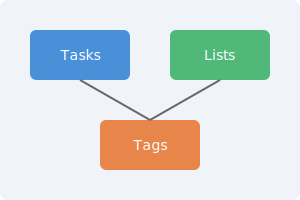

# Image Examples

This page demonstrates image rendering with various path types.

## SVG from a Subdirectory

This image uses a relative path to an SVG in the `images/` folder:

## Small Icon

A smaller SVG icon, also from the `images/` folder:

## External Image

An image loaded from an external URL (absolute path, should work without the resolver):

## Image in a List

-  Tasks are the core unit of work
- Lists group tasks together
- Tags help filter and organize

## Image in a Table

| Feature | Icon |
|---------|------|
| Tasks |  |
