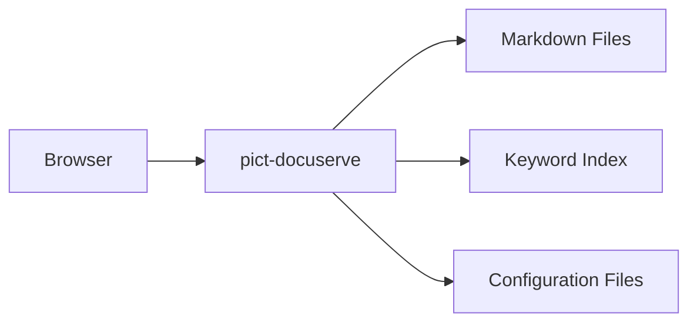

# Architecture

## System Components

## Data Flow

1. Browser loads `index.html`
2. Pict framework initializes
3. Provider loads configuration files in parallel
4. Layout view renders the shell
5. Hash change listener dispatches navigation
6. Content is fetched and parsed on demand
