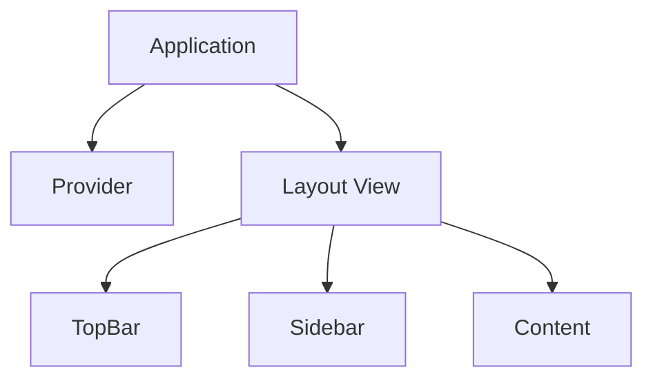

# Architecture

This page tests that nested paths (`guides/architecture.md`) work correctly when served as local pages.

## Components

1. **Provider** — Handles data loading and markdown parsing
2. **Views** — Render the UI components (layout, topbar, sidebar, content, splash, search)
3. **Application** — Orchestrates routing and navigation

## Diagram

> This blockquote should render with a green left border.
